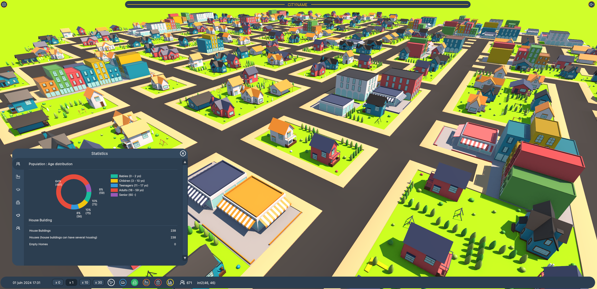

# Learn DOTS - CItyBuilder

This project is just a very very simple prototype to learn the Unity's Data-Oriented Technology Stack.
I want to learn how to structure a game using ECS, make a basic city simulation with systems and how to make tasks such as pathfinding efficiently.


## Game simulation

This all system I want to implement for my basic simulation, in order :

- **Update Time System Group**
  - Time Manager System : update time depending on time scale. To access its data outside a system, use ```TimeManagerMonoHandler```.
  - Apply Time To Citizen System : make them teenagers, adulys, retired or dead
  - Get Salary System
  - Get Tax System
  - Compute Happyness and City Attraction System
- SpawnBuilding System : Spawn buildings
- **Citizen System Group**
  - Spawn Citizen System : creating new citizens depending on free houses, level of city attraction
  - Apply To Job System : unemployed citizens, not student, in range 18 -> 65 years old try to get a job
  - Apply To School System : kids from 3 to 24 year old can apply to school
  - Citizen Go To DailyLife System : in the morning, set a citizen target if their are students or employed
  - Go Back Home System : in the afternoon, make citizens go back to their home
  - Go To Entertainment System : at evening or weekends, inhabitants can go to the theatre, concert, etc if they are close enough to.
  - Manager Citizen Health System : citizens can get sick (4 levels of sickness)
  - Citizen Path Finding System : compute path from pathfinding requests added from (go to daily life and go back home system)
  - Move City Entities : move cars and inhabitants if they have a target
- Delete/Create Building System : create or delete entity buildings according to ```BuildingBuilderController```.

All sound effects comes from https://pixabay.com/sound-effects/search/ui/.
All icons comes from https://lucide.dev/.